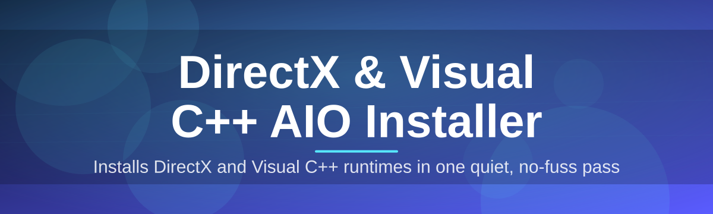

# dx-vcpp-aio-installer-suite

Installs DirectX and Visual C++ runtimes in one quiet, no-fuss pass

  

## Overview

Installs DirectX and Visual C++ runtimes in one quiet, no-fuss pass

## License

[MIT License](LICENSE)
